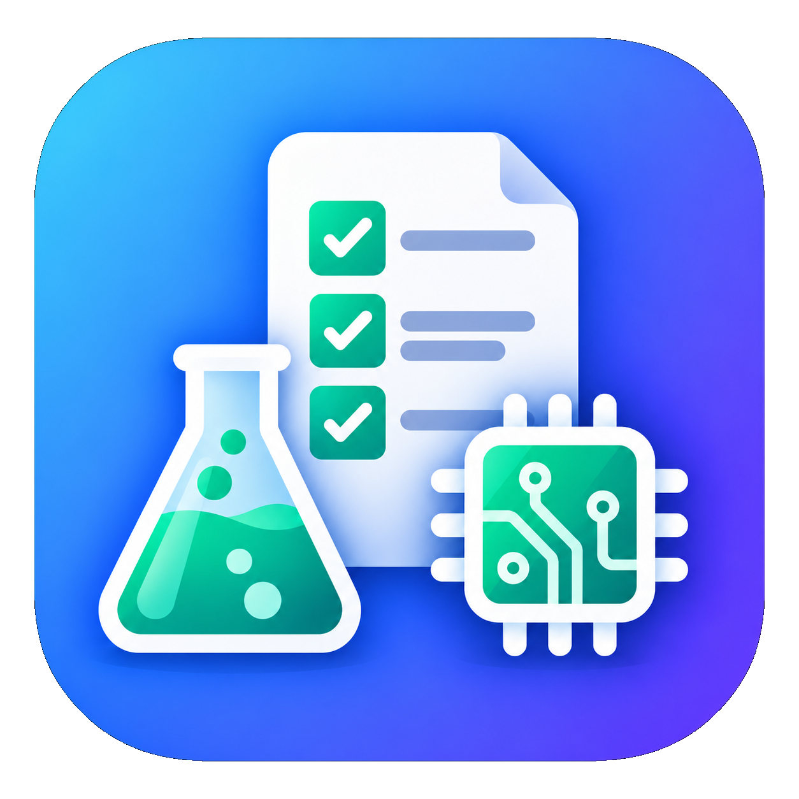

# RubriLab

**English** · [Español](README.es.md) · [Català](README.ca.md)

**Local-first practical classroom evidence**

<p align="center">
  
</p>

RubriLab is a local desktop application for organising practical laboratory
sessions, student groups, attendance, and assessment evidence in secondary
education.

Teachers import their classroom rosters, create a session when it is needed,
and record team and individual evidence while students work. The application
does not need an account, a remote database, or an external service: classroom
records remain on the device.

## Features

- CSV and JSON import for classes, students, school identifiers, and laboratory groups.
- Duplicate-aware roster updates using a school identifier or a name match within a class.
- Session creation from imported groups, with membership captured as a session snapshot.
- Configurable team and individual assessment presets for future sessions.
- Live team status, teacher-assistance level, practical result, notes, and criterion evidence.
- Individual attendance, observation, and positive or incident behaviour records.
- Session history with editing, deletion, and evidence reconstruction.
- Assessment overview, evidence-coverage review, student and team views, and CSV exports.
- Full local JSON backup export and a resettable fictional starter workspace.
- Offline-capable web renderer and an Electron desktop shell for macOS, Windows, and Linux.

## Application areas

| Area | Purpose |
| --- | --- |
| `Today` | Run an open practical session and capture attendance and evidence while teaching. |
| `Classes` | Import and review classes, students, school IDs, and laboratory groups. |
| `History` | Create, inspect, edit, reopen, or delete practical session records. |
| `Assessment` | Review coverage and evidence by class, student, team, and assessment period; export CSV files. |
| `Settings` | Manage assessment presets, export a complete backup, or reset the local workspace. |

## Technology stack

- React and TypeScript with Vinext and Vite.
- Next.js-compatible App Router structure and Tailwind CSS global styles.
- Dexie and IndexedDB for browser-local persistence.
- Zod validation and repository interfaces separating the domain from persistence.
- Electron with a context-isolated preload bridge, sandboxed renderer, and no Node.js integration.
- Node.js test runner and ESLint for verification.

## Requirements

- Node.js `22.13.0` or newer.
- npm, using the included `package-lock.json`.
- A writable local browser or Electron application-data directory.

No environment variables, database server, account, or network connection are
required for ordinary local use.

## Installation

Clone the repository, enter its directory, and install the locked dependencies:

```bash
git clone https://github.com/abujalancej/rubrilab.git
cd rubrilab
npm ci
```

If you are working from an existing checkout and intentionally need to update
the lockfile, use `npm install` instead.

## Development

Start the local web application:

```bash
npm run dev
```

Open [http://localhost:3000](http://localhost:3000). The first launch creates a
fictional starter class and assessment presets, but no sessions or evidence.

To open the same renderer in Electron during development:

```bash
npm run electron:dev
```

The Electron helper starts the local server when necessary, waits for it to be
ready, and opens RubriLab in a desktop window.

## Production build

Create the production renderer:

```bash
npm run build
```

Run the compiled renderer locally:

```bash
npm start
```

## Desktop application

RubriLab is packaged as an Electron desktop application for macOS, Windows,
and Linux. The installed application starts its local renderer on the loopback
interface; no external server is required. Its renderer has context isolation,
process sandboxing, and Node.js integration disabled. External HTTPS and mail
links open in the system browser rather than in the application window.

Create an unpacked bundle for the current platform and architecture:

```bash
npm run electron:build
```

Create the distributable for the current platform and architecture:

```bash
npm run electron:dist
```

Desktop artifacts are grouped under `out/`: `out/mac/` on macOS, `out/win/` on
Windows, and `out/linux/` on Linux. DMG, EXE, and AppImage files use
`RubriLab-<version>-<os>-<arch>.<ext>`. Packaging another operating system is
normally done on that operating system. Code signing and notarisation are not
configured yet.

## Usage

1. Open **Classes** and import the school package as CSV or JSON. Every row
   needs first name, last name, class, and laboratory group; a school ID is
   optional. Existing students are matched by school ID first, then by name
   within the class.
2. Open **Settings** and review or create the team and individual assessment
   presets that should be available for future sessions.
3. Open **History**, create a practical session, select its class and the
   imported groups, and choose the assessment presets for that session. Group
   membership is copied into the session and remains historical evidence.
4. In **Today**, record attendance, group status, teacher assistance, practical
   result, criterion scores, notes, and individual observations while teaching.
5. Finish a session when the practical work ends. Use **History** to correct or
   reopen a session when needed.
6. Open **Assessment** to review coverage, attendance, student evidence, and
   teams for an assessment period. Export attendance, individual evidence, or
   team evidence as CSV when required.
7. Download a complete JSON backup from **Settings** before a device change or
   substantial local-data cleanup.

## Data storage

RubriLab does **not** use a remote database. The web renderer stores its data
in the browser's IndexedDB database named `rubrilab`. The Electron application
uses the corresponding Chromium profile inside Electron's per-user application
data directory.

The stored snapshot contains classes, students, sessions, session teams,
attendance, presets, criteria, observations, assistance records, practical
results, assessment periods, and weight configurations. A JSON backup exported
from **Settings** is the portable copy of that local data.

### Important storage considerations

- Back up the JSON snapshot before resetting the workspace, clearing browser
  data, reinstalling the desktop application, or moving to another device.
- Imported rosters and observations may contain personal student information;
  never add real school data to Git or share it publicly.
- Session teams are snapshots. Later roster or group changes do not rewrite
  membership or evidence captured in earlier sessions.
- The application is designed for a private, single-user local installation.
  It has no authentication or multi-user synchronisation.
- Browser-private or Electron application data can be removed by system or
  browser cleanup. Keep an exported backup outside the application directory.

## Data model

The local snapshot has these top-level collections:

```json
{
  "classrooms": [],
  "students": [],
  "sessions": [],
  "teams": [],
  "attendance": [],
  "presets": [],
  "criteria": [],
  "teamObservations": [],
  "individualObservations": [],
  "behaviourObservations": [],
  "teacherAssistance": [],
  "practicalResults": [],
  "assessmentPeriods": [],
  "weightConfigurations": []
}
```

A student belongs to one classroom and can include an optional school
identifier and laboratory-group name. A session records the selected class,
subject, status, team and individual presets, and its own frozen team
membership. Missing assessment scores mean **not observed**; zero is not a
valid score.

## Project structure

```text
rubrilab/
├── app/                       # App entry point, metadata, manifest, and global styles
├── electron/                  # Secure Electron main process and preload bridge
├── public/                    # Service worker and RubriLab branding assets
├── scripts/                   # Electron development, packaging, and icon helpers
├── src/
│   ├── data/                  # Dexie persistence, repositories, seed data, and roster import
│   ├── domain/                # TypeScript model and Zod validation contracts
│   └── ui/                    # React workspaces, dialogs, and local-data hook
├── tests/                     # Rendered-shell and architecture checks
├── worker/                    # Worker entry point for the web build
├── package.json               # Application scripts and Electron Builder configuration
└── README.md                  # English project documentation
```

The UI accesses local data through repository interfaces in `src/data/`; the
domain model and validation contracts remain separate in `src/domain/`.

## Available scripts

| Command | Description |
| --- | --- |
| `npm run dev` | Start the local Vinext development server on port `3000`. |
| `npm run build` | Create the production web renderer in `dist/`. |
| `npm start` | Start the compiled local renderer. |
| `npm run electron:dev` | Start the renderer if needed and open it in Electron. |
| `npm run electron:build` | Build the renderer and create an unpacked Electron bundle for the current platform. |
| `npm run electron:dist` | Build the renderer and create the current platform's distributable. |
| `npm run lint` | Run ESLint, excluding generated build output. |
| `npm test` | Build the renderer and run the Node.js test suite. |

## Validation

Before committing code changes, run:

```bash
npm run lint
npm test
```

For a desktop release, also build the target artifact and test the generated
application on that operating system:

```bash
npm run electron:dist
```
